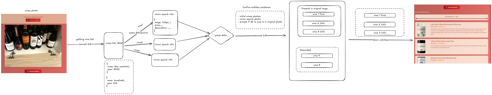

# wAIne
### GitHub Repository

🔗 [GitHub: rodrigofariow/geekathon-24-xico-squad](https://github.com/rodrigofariow/geekathon-24-xico-squad)

### Web Application

🌐 [Web Application: help.wine](https://help.wine)

- **User:** xico
- **Password:** xicothecat

## Docs

🌐 [Notion](https://www.notion.so/149b3ea64b89809e9dd5e9387c391da4)

### Sample Images for Testing

If you don’t have photos of wine bottles available, we’ve got you covered. You can use one of the sample images provided in the GitHub repository:

- `test_images/bottles1.jpeg`
- `test_images/bottles2.jpeg`
- `test_images/bottles3.jpeg`

### Architecture

[Diagram Link](https://excalidraw.com/#json=EH3HxmxpXen4KmKU6kPXW,9SSKtF-DZp-ssdgEkjzLeA)

